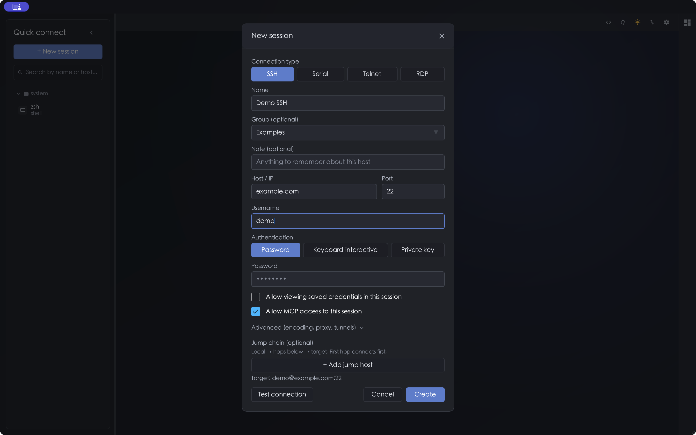
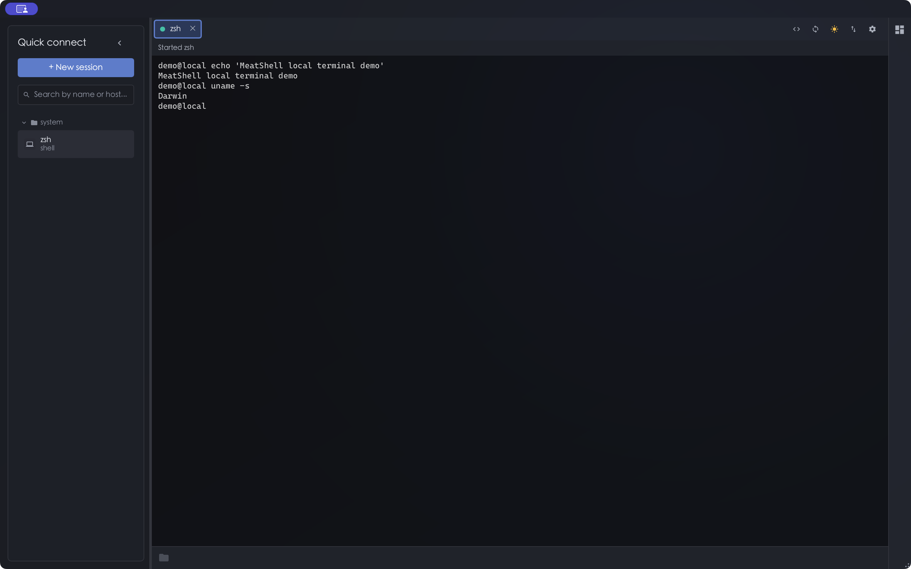
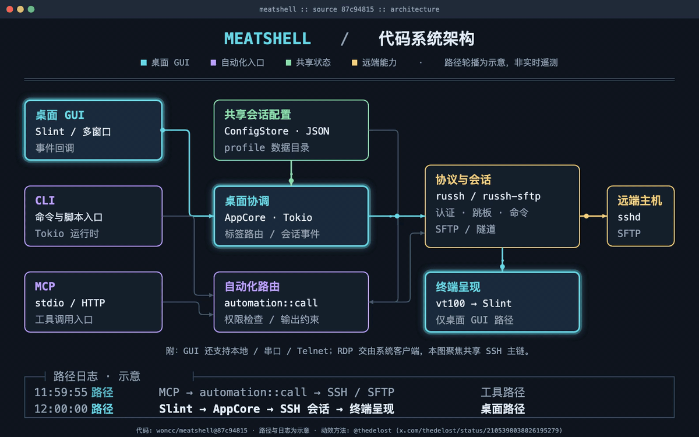

# MeatShell

[简体中文](./README.md) | **English**

MeatShell is a cross-platform SSH and terminal client built with **Rust + [Slint](https://slint.dev)**. It brings session management, tabbed terminals, SFTP transfers, and resource monitoring into one desktop interface, with CLI and MCP entry points for automation.

## Screenshots

<p align="center">
  <br>
  <em>Session management for SSH, serial, Telnet, and RDP; the host and username are examples</em>
</p>

<p align="center">
  <br>
  <em>Local terminal and tabs; no remote host is connected in this demo</em>
</p>

These screenshots use an isolated v0.7.5 demo profile. `example.com` and `demo` are example values; no real server, credential, or personal path is shown.

## Architecture



Drawn from commit `87c94815cc53537cc5d0ab57815eb03a9d297504`. The route cycle and packets illustrate module relationships; they are not live telemetry. [Open the full-size animation](assets/architecture-live.gif).

## Highlights

- **Connections and sessions:** SSH password and key authentication, `known_hosts` checks, groups, import/export, proxies, jump hosts, and port forwarding.
- **Terminal:** local and remote shells, tabs and splits, VT/ANSI full-screen apps, quick commands, plus serial and Telnet sessions. RDP opens through an external client.
- **Files and monitoring:** SFTP browsing and transfers, ZMODEM, and local/remote resource monitoring.
- **Automation:** CLI and stdio MCP share saved sessions. A remote HTTP MCP deployment is optional.

## Download and run

Choose a package for your platform from [woncc/meatshell Releases](https://github.com/woncc/meatshell/releases):

| Platform | Common packages |
| --- | --- |
| Windows | `.zip` or `.msi` |
| Linux | `.AppImage`, `.deb`, `.flatpak`, or `.tar.gz` |
| macOS | `.zip` containing `meatshell.app`, for Apple Silicon or Intel |

After starting the app, select **New session** and enter the target host and authentication method. Verify the host-key fingerprint before accepting a first connection. On Linux, you can run `./meatshell` from the extracted tarball or use the included `install-linux.sh`. To build from source:

```bash
cargo build --locked --release
```

Linux source builds need the graphical development packages used by Slint/winit. See [docs/release.md](docs/release.md) for the release process.

## CLI and MCP

CLI and MCP use the same session profile. Save a session in the GUI and complete its first host-key check before automating it:

```bash
meatshell cli help
meatshell cli sessions
meatshell cli exec <session-id> -- date
```

Get `<session-id>` from `meatshell cli sessions`. For machines without a GUI, build with `--features headless`. You can check an import with `meatshell cli import <file> --dry-run`. Portable exports may contain recoverable credentials, so handle them as sensitive files.

For local stdio MCP, enable the required permissions in **Settings → Interface → MCP** and set an absolute executable path in your MCP client:

```json
{
  "mcpServers": {
    "meatshell": {
      "command": "/absolute/path/to/meatshell",
      "args": ["mcp", "serve"]
    }
  }
}
```

Allow saved credentials, remote commands, and file transfers only for trusted clients. For optional remote HTTP MCP with OAuth 2.1, see [docs/REMOTE_MCP.md](docs/REMOTE_MCP.md) for deployment steps and security limits.

## License and credits

Dual licensed under **MIT OR Apache-2.0**. Color emoji graphics come from [Twemoji](https://github.com/jdecked/twemoji) under [CC BY 4.0](https://creativecommons.org/licenses/by/4.0/); see [THIRD_PARTY_NOTICES.md](THIRD_PARTY_NOTICES.md) for full attribution.
