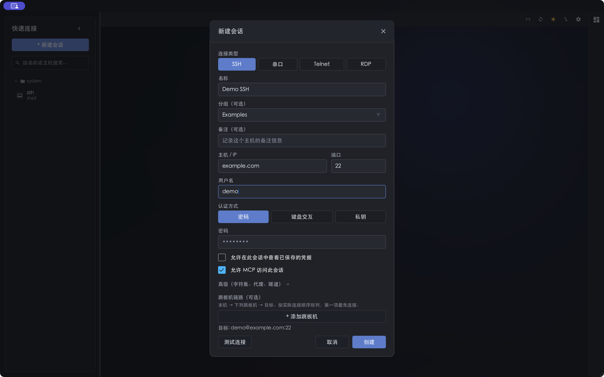
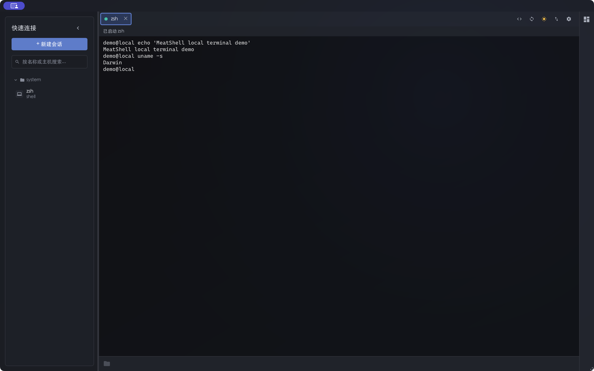

# MeatShell

**简体中文** | [English](./README.en.md)

MeatShell 是用 **Rust + [Slint](https://slint.dev)** 编写的跨平台 SSH 与终端客户端。它将会话管理、多标签终端、SFTP 文件传输和资源监控放在同一个桌面界面中，并提供 CLI 与 MCP 入口。

## 界面

<p align="center">
  <br>
  <em>会话管理：SSH、串口、Telnet、RDP；图中主机和账号均为演示值</em>
</p>

<p align="center">
  <br>
  <em>本地终端与标签页；演示中未连接远端主机</em>
</p>

截图取自 v0.7.5 的独立演示配置；`example.com`、`demo` 为示例值，未使用真实服务器、凭据或个人路径。

## 系统架构


基于代码提交 `87c94815cc53537cc5d0ab57815eb03a9d297504` 绘制。动画展示模块关系，路径轮播和数据包不是实时运行数据。[查看原尺寸动图](assets/architecture-live.gif)。

## 主要功能

- **连接与会话**：SSH 密码和私钥认证、`known_hosts` 校验、分组、导入导出、代理、跳板机与端口转发。
- **终端**：本地与远端 Shell、多标签和分屏、VT/ANSI 全屏程序、快捷命令；还支持串口、Telnet 和通过外部客户端打开 RDP。
- **文件与监控**：SFTP 浏览、上传和下载、ZMODEM，以及本机和远端资源监控。
- **自动化**：CLI 与 stdio MCP 共用已保存的会话；远程 HTTP MCP 为可选部署方式。

## 下载与使用

从 [woncc/meatshell Releases](https://github.com/woncc/meatshell/releases) 选择对应平台的安装包：

| 平台 | 常见安装包 |
| --- | --- |
| Windows | `.zip` 或 `.msi` |
| Linux | `.AppImage`、`.deb`、`.flatpak` 或 `.tar.gz` |
| macOS | 包含 `meatshell.app` 的 `.zip`，提供 Apple Silicon 与 Intel 版本 |

启动后点击 **新建会话**，填入目标主机及认证方式。首次连接需确认主机密钥；请先核对指纹。Linux 的 tar 包可解压后直接运行 `./meatshell`，也可使用包内的 `install-linux.sh`。源码构建可运行：

```bash
cargo build --locked --release
```

Linux 源码构建需要 Slint/winit 等图形开发依赖。发版流程见 [docs/release.md](docs/release.md)。

## CLI 与 MCP

CLI 和 MCP 使用同一份会话配置。先在 GUI 中保存会话并完成首次主机密钥确认：

```bash
meatshell cli help
meatshell cli sessions
meatshell cli exec <session-id> -- date
```

`<session-id>` 可从 `meatshell cli sessions` 获取。无 GUI 的环境可构建 `--features headless`；会话导入可先执行 `meatshell cli import <file> --dry-run` 检查结果。便携导出文件可能包含可还原的凭据，应按敏感文件保管。

要连接本地 stdio MCP，在 **设置 → 界面 → MCP** 启用所需权限，并在 MCP 客户端中配置可执行文件的绝对路径：

```json
{
  "mcpServers": {
    "meatshell": {
      "command": "/absolute/path/to/meatshell",
      "args": ["mcp", "serve"]
    }
  }
}
```

仅向可信客户端开放已保存凭据、远程命令和文件传输权限。带 OAuth 2.1 的远程 HTTP MCP 部署步骤与安全边界见 [docs/REMOTE_MCP.md](docs/REMOTE_MCP.md)。

## 许可与致谢

项目采用 **MIT OR Apache-2.0** 双许可。彩色 emoji 图形来自 [Twemoji](https://github.com/jdecked/twemoji)，按 [CC BY 4.0](https://creativecommons.org/licenses/by/4.0/) 使用；完整署名见 [THIRD_PARTY_NOTICES.md](THIRD_PARTY_NOTICES.md)。
